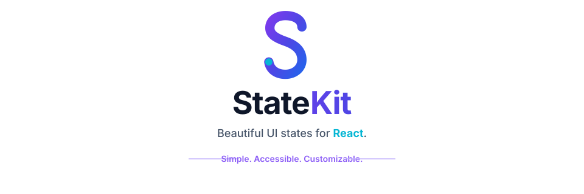

<p align="center">
  
</p>

<div align="center">

<p>
  <a href="https://www.npmjs.com/package/@statekitjs/react"></a>
  
  
  
</p>

<p>
Stop rewriting loading, empty, error, and success UI.
Build consistent user experiences with one elegant API.
</p>

</div>

# Why StateKitJS?

Every React application repeats the same UI patterns.

```tsx
if (loading) return <Spinner />

if (error) return <Error />

if (!users.length) return <Empty />

return <Users />
```

Eventually every project becomes filled with duplicated rendering logic.

StateKitJS replaces all of that with one declarative component.

```tsx
<State
    loading={loading}
    error={error}
    empty={users.length === 0}
>
    <Users />
</State>
```

Simple.

Reusable.

Readable.

Consistent.


# Features

- 🚀 One-line state rendering
- 📦 Beautiful loading states
- ❌ Elegant error components
- 📭 Empty state components
- 🦴 Responsive skeleton loaders
- 🌙 Dark mode ready
- 📱 Mobile responsive
- ♿ Accessibility first
- 🌲 Tree-shakable
- ⚡ Tiny bundle size
- 🔷 TypeScript support
- 🎨 Fully customizable


# Packages

| Package | Description |
|----------|-------------|
| **@statekitjs/react** | React component library |

More packages are planned.

- @statekitjs/icons
- @statekitjs/themes
- @statekitjs/utils
- @statekitjs/cli


# Quick Example

```tsx
import { State } from "@statekitjs/react";

function UsersPage() {

    return (

        <State
            loading={loading}
            error={error}
            empty={users.length === 0}
        >

            <UsersTable />

        </State>

    );

}
```


# Installation

```bash
npm install @statekitjs/react
```

or

```bash
pnpm add @statekitjs/react
```


# Project Structure

```
statekit
│
├── packages/
│   └── react/
│
├── apps/
│   ├── website/
│   └── playground/
│
├── docs/
│
├── examples/
│
└── rfcs/
```


# Philosophy

StateKitJS focuses on one thing.

Making application states beautiful.

Instead of writing repetitive conditional rendering across your application, developers should describe the state—not how to render it.


# Roadmap

## v0.2

- Animated Loading
- Card Skeleton
- Dashboard Skeleton
- Timeline Skeleton


## v0.3

- React Query Integration
- SWR Integration
- RTK Query Integration


## v0.4

- Theme System
- Dark Mode
- Custom Animations


## v1.0

- Stable API
- Complete Documentation
- Production Ready


# Contributing

We welcome contributions.

```bash
git clone https://github.com/devsruthi/statekit.git

pnpm install

pnpm dev
```


# Documentation

Coming soon.

- API Documentation
- Storybook
- Live Playground
- Examples
- Recipes
- [Branding assets](./docs/branding.md)


# Built With

- React
- TypeScript
- Vite
- Storybook
- Vitest
- pnpm Workspaces
- Changesets
- GitHub Actions


# License

MIT


<div align="center">

### ⭐ If you like StateKitJS, please consider giving it a Star.

Built with ❤️ by Sruthi

</div>
